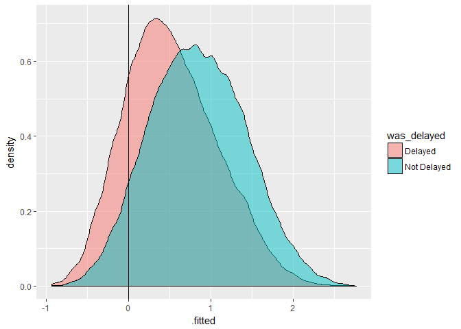
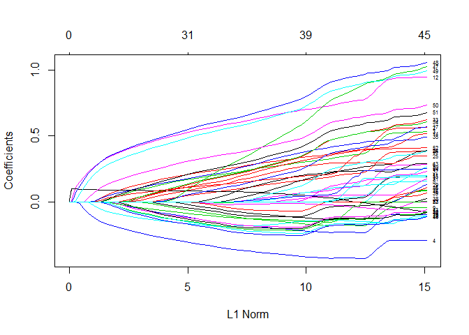

Our R project
================

Packages
--------

Packages we'll look at today:

-   odbc, readxl, readr, dbplyr for data access
-   tidyverse for data manipulation
-   DataExplorer for providing automated EDA of our data
-   modelr, rsamples for sampling
-   recipes for performing feature engineering
-   glmnet, h2o, FFTrees for building models
-   yardstick, broom for evaluation
-   rmarkdown for documentation

Working with databases
----------------------

We need a database connection before we can do anything with our database.

``` r
library(DBI)
library(odbc)

driver = "SQL Server" 
server = "fbmcsads.database.windows.net"
database = "WideWorldImporters-Standard"
uid = "adatumadmin"
pwd = "Pa55w.rdPa55w.rd"

con<-dbConnect(odbc(),
               driver = driver, 
               server = server,
               database = database,
               uid = uid,
               pwd = pwd)
```

Now that we have a DB connection, we can write SQL in a code chunk.

``` sql
select top 5 * from flights
```

|  year|  month|  day|  dep\_time|  sched\_dep\_time|  dep\_delay|  arr\_time|  sched\_arr\_time|  arr\_delay| carrier |  flight| tailnum | origin | dest |  air\_time|  distance|  hour|  minute| time\_hour          |
|-----:|------:|----:|----------:|-----------------:|-----------:|----------:|-----------------:|-----------:|:--------|-------:|:--------|:-------|:-----|----------:|---------:|-----:|-------:|:--------------------|
|  2013|      1|    1|        517|               515|           2|        830|               819|          11| UA      |    1545| N14228  | EWR    | IAH  |        227|      1400|     5|      15| 2013-01-01 05:00:00 |
|  2013|      1|    1|        533|               529|           4|        850|               830|          20| UA      |    1714| N24211  | LGA    | IAH  |        227|      1416|     5|      29| 2013-01-01 05:00:00 |
|  2013|      1|    1|        542|               540|           2|        923|               850|          33| AA      |    1141| N619AA  | JFK    | MIA  |        160|      1089|     5|      40| 2013-01-01 05:00:00 |
|  2013|      1|    1|        544|               545|          -1|       1004|              1022|         -18| B6      |     725| N804JB  | JFK    | BQN  |        183|      1576|     5|      45| 2013-01-01 05:00:00 |
|  2013|      1|    1|        554|               600|          -6|        812|               837|         -25| DL      |     461| N668DN  | LGA    | ATL  |        116|       762|     6|       0| 2013-01-01 06:00:00 |

We can use dbplyr to construct dplyr commands that work on the DB.

``` r
library(tidyverse)
```

    ## -- Attaching packages --------------------------------------- tidyverse 1.2.1 --

    ## v ggplot2 2.2.1     v purrr   0.2.4
    ## v tibble  1.4.2     v dplyr   0.7.4
    ## v tidyr   0.8.0     v stringr 1.3.0
    ## v readr   1.1.1     v forcats 0.2.0

    ## -- Conflicts ------------------------------------------ tidyverse_conflicts() --
    ## x dplyr::filter() masks stats::filter()
    ## x dplyr::lag()    masks stats::lag()

``` r
library(dbplyr)
```

    ## 
    ## Attaching package: 'dbplyr'

    ## The following objects are masked from 'package:dplyr':
    ## 
    ##     ident, sql

``` r
flights_tbl<-tbl(con, "flights")

flights_tbl %>% 
  filter(month<=6) %>% 
  group_by(origin) %>% 
  summarise(n = n(), 
            mean_dist= mean(distance)) %>% 
  show_query()
```

    ## <SQL>
    ## SELECT "origin", COUNT(*) AS "n", AVG("distance") AS "mean_dist"
    ## FROM "flights"
    ## WHERE ("month" <= 6.0)
    ## GROUP BY "origin"

We can also work with tables that aren't in the default schema.

``` r
purchaseorders_tbl<-tbl(con, in_schema("purchasing","purchaseorders"))

purchaseorders_tbl %>% 
  top_n(5)
```

    ## Selecting by LastEditedWhen

    ## # Source:   lazy query [?? x 12]
    ## # Database: Microsoft SQL Server
    ## #   12.00.0300[dbo@fbmcsads/WideWorldImporters-Standard]
    ##   PurchaseOrderID SupplierID OrderDate  DeliveryMethodID ContactPersonID
    ##             <int>      <int> <chr>                 <int>           <int>
    ## 1            2073          4 2016-05-31                7               2
    ## 2            2074          7 2016-05-31                2               2
    ## 3            2071          4 2016-05-30                7               2
    ## 4            2072          7 2016-05-30                2               2
    ## 5            2068          4 2016-05-27                7               2
    ## 6            2069          7 2016-05-27                2               2
    ## 7            2070          4 2016-05-28                7               2
    ## # ... with 7 more variables: ExpectedDeliveryDate <chr>,
    ## #   SupplierReference <chr>, IsOrderFinalized <lgl>, Comments <chr>,
    ## #   InternalComments <chr>, LastEditedBy <int>, LastEditedWhen <chr>

We can use the `Id()` function from DBI to work with schema more generically within a database. This means we aren't restricted to just SELECT statements.

``` r
# Create a schema to work in - errors if already exists
dbGetQuery(con,"CREATE SCHEMA DBIexample")
```

    ## Error: <SQL> 'CREATE SCHEMA DBIexample'
    ##   nanodbc/nanodbc.cpp:1587: 42S01: [Microsoft][ODBC SQL Server Driver][SQL Server]There is already an object named 'DBIexample' in the database.

``` r
# Write some data - drop & recreate the table if it exists already
dbWriteTable(con, "iris", iris, overwrite=TRUE) 
# Read from newly written table
head(dbReadTable(con, "iris"))
```

    ##   Sepal.Length Sepal.Width Petal.Length Petal.Width Species
    ## 1          5.1         3.5          1.4         0.2  setosa
    ## 2          4.9         3.0          1.4         0.2  setosa
    ## 3          4.7         3.2          1.3         0.2  setosa
    ## 4          4.6         3.1          1.5         0.2  setosa
    ## 5          5.0         3.6          1.4         0.2  setosa
    ## 6          5.4         3.9          1.7         0.4  setosa

``` r
# Read from a table in a schema
head(dbReadTable(con, Id(schema="20774A",table="CustomerTransactions")))
```

    ## Note: method with signature 'DBIConnection#SQL' chosen for function 'dbQuoteIdentifier',
    ##  target signature 'Microsoft SQL Server#SQL'.
    ##  "OdbcConnection#character" would also be valid

    ##                  CustomerName TransactionAmount OutstandingBalance
    ## 1             Aakriti Byrraju           2645.00                  0
    ## 2                  Bala Dixit            465.75                  0
    ## 3 Tailspin Toys (Head Office)            103.50                  0
    ## 4 Tailspin Toys (Head Office)            511.98                  0
    ## 5                Sara Huiting            809.60                  0
    ## 6                Alinne Matos            494.50                  0
    ##   TaxAmount PKIDDate TransactionDate
    ## 1    345.00 20130101      2013-01-01
    ## 2     60.75 20130101      2013-01-01
    ## 3     13.50 20130101      2013-01-01
    ## 4     66.78 20130101      2013-01-01
    ## 5    105.60 20130101      2013-01-01
    ## 6     64.50 20130101      2013-01-01

``` r
# If a write method is supported by the driver, this will work
dbWriteTable(con, Id(schema="DBIexample", table="iris"), iris, overwrite=TRUE)
```

    ## Error in (function (classes, fdef, mtable) : unable to find an inherited method for function 'dbWriteTable' for signature '"Microsoft SQL Server", "SQL", "missing"'

Some of our code could fail in that section so we used `error=TRUE` to be able to carry on even if some of the code errored. Great for optional code or things with bad connections.

Exploratory Data Analysis
-------------------------

``` r
flights_tbl %>% 
  as_data_frame() %>% 
  DataExplorer::GenerateReport()
```

Questions arising from the basic report:

1.  Why is there a day with double the number of flights?
2.  Why is there negative correlation between `flight` (flight number) and `distance`?
3.  Do we need to anything about missings or can we just remove the rows?

Things to implement later in the workflow due to the EDA:

1.  We need to address the high correlation between time columns
2.  We need to group low frequency airline carriers
3.  Bivariate analysis

### Answering our questions

> Why is there a day with double the number of flights?

Are there duplicate rows?

``` r
flights_tbl %>% 
  filter(day==15) %>% 
  distinct() %>% 
  summarise(n()) %>% 
  as_data_frame() ->
  distinct_count

flights_tbl %>% 
  filter(day==15) %>% 
  summarise(n())%>% 
  as_data_frame() ->
  row_count

identical(row_count, distinct_count)
```

    ## [1] TRUE

But are the number of rows unusual?

``` r
library(ggplot2)
flights_tbl %>% 
  group_by(day) %>% 
  summarise(n=n(), n_unique=n_distinct(flight)) %>% 
  as_data_frame() %>% 
  ggplot(aes(x=day, y=n)) +
    geom_col()
```

 Looks like the jump in the histogram is an artifact of binning the data. d'oh!

### Bivariate analysis

``` r
flights_tbl %>% 
  select_if(is.numeric) %>% 
  as_data_frame() %>% 
  gather(col, val, -dep_delay) %>% 
  filter(col!="arr_delay",
         dep_delay<500) %>% 
  ggplot(aes(x=val, y=dep_delay)) +
    geom_bin2d() +
    facet_wrap(~col, scales = "free")+
    scale_fill_gradientn(colours = viridisLite::viridis(256, option = "D"))
```

    ## Applying predicate on the first 100 rows

    ## Warning: Removed 1631 rows containing non-finite values (stat_bin2d).

    ## Warning: Computation failed in `stat_bin2d()`:
    ## 'from' must be a finite number


Sampling
--------

### Theory / Info

Our options for sampling data with a large class imbalance are:

-   Downsampling takes as many majority rows and there are minority rows
    -   No overfit from individual rows
    -   Can drastically reduce training data size
-   Upsampling or over sampling repeats minority rows until they meet some defined class ratio
    -   Risks overfitting
    -   Doesn't reduce training data set
-   Synthesising data makes extra records that are like the minority class
    -   Doesn't reduce training set
    -   Avoids some of the overfit risk of upsampling
    -   Can weaken predictions if minority data is very similar to majority

We need to think about whether we need to k-fold cross-validation explicitly.

-   Run the same model and assess robustness of coefficients
-   We have an algorithm that needs explicit cross validation because it doesn't do it internally
-   When we're going to run lots of models with hyper-parameter tuning so the results are more consistent

We use bootstrapping when we want to fit a single model and ensure the results are robust. This will often do many more iterations than k-fold cross validation, making it better in cases where there's relatively small amounts of data.

Packages we can use for sampling include:

-   modelr which facilitates basic, bootstrap, and k-fold crossvalidation strategies
-   rsample allows us to bootstrap and perform a wide variety of crossvalidation tasks
-   recipes allows us to upsample and downsample
-   synthpop allows us to build synthesised samples

### Practical

First we need to split our data into test and train.

``` r
flights_tbl %>% 
  as_data_frame() ->
  flights

flights %>% 
  mutate(was_delayed= ifelse(arr_delay>5,"Delayed", "Not Delayed"),
         week = ifelse(day %/% 7 > 3, 3, day %/% 7 )) ->
  flights

flights %>%   
  modelr::resample_partition(c(train=0.7,test=0.3)) ->
  splits

splits %>% 
  pluck("train") %>% 
  as_data_frame()->
  train_raw

splits %>% 
  pluck("test") %>% 
  as_data_frame()->
  test_raw
```

During the investigation, we'll look at the impact of upsampling. We'll see it in action in a bit. First prepping our basic features!

``` r
library(recipes)
```

    ## Loading required package: broom

    ## 
    ## Attaching package: 'recipes'

    ## The following object is masked from 'package:stringr':
    ## 
    ##     fixed

    ## The following object is masked from 'package:stats':
    ## 
    ##     step

``` r
basic_fe <- recipe(train_raw, was_delayed ~ .)

basic_fe %>% 
  step_rm(ends_with("time"), ends_with("delay"),tailnum, flight,
          minute, time_hour, day) %>% 
  step_naomit(all_predictors()) %>% 
  step_naomit(all_outcomes()) %>% 
  step_zv(all_predictors()) %>% 
  step_nzv(all_predictors()) %>% 
  step_other(all_nominal(),threshold = 0.03)  ->
  colscleaned_fe

colscleaned_fe <- prep(colscleaned_fe, verbose = TRUE)
```

    ## oper 1 step rm [training] 
    ## oper 2 step naomit [training] 
    ## oper 3 step naomit [training] 
    ## oper 4 step zv [training] 
    ## oper 5 step nzv [training] 
    ## oper 6 step other [training]

``` r
colscleaned_fe
```

    ## Data Recipe
    ## 
    ## Inputs:
    ## 
    ##       role #variables
    ##    outcome          1
    ##  predictor         20
    ## 
    ## Training data contained 235743 data points and 6510 incomplete rows. 
    ## 
    ## Operations:
    ## 
    ## Variables removed dep_time, sched_dep_time, arr_time, ... [trained]
    ## Removing rows with NA values in all_predictors()
    ## Removing rows with NA values in all_outcomes()
    ## Zero variance filter removed year [trained]
    ## Sparse, unbalanced variable filter removed no terms [trained]
    ## Collapsing factor levels for carrier, origin, dest, was_delayed [trained]

``` r
train_prep1<-bake(colscleaned_fe, train_raw)
```

Now we need to process our numeric variables.

``` r
colscleaned_fe  %>% 
  step_log(distance) %>% 
  step_num2factor(month, week, hour) %>% 
  step_rm(tailnum, dest) -> #hack!
  numscleaned_fe

numscleaned_fe <- prep(numscleaned_fe, verbose = TRUE)
```

    ## oper 1 step rm [pre-trained]
    ## oper 2 step naomit [pre-trained]
    ## oper 3 step naomit [pre-trained]
    ## oper 4 step zv [pre-trained]
    ## oper 5 step nzv [pre-trained]
    ## oper 6 step other [pre-trained]
    ## oper 7 step log [training] 
    ## oper 8 step num2factor [training] 
    ## oper 9 step rm [training]

``` r
numscleaned_fe
```

    ## Data Recipe
    ## 
    ## Inputs:
    ## 
    ##       role #variables
    ##    outcome          1
    ##  predictor         20
    ## 
    ## Training data contained 235743 data points and 6510 incomplete rows. 
    ## 
    ## Operations:
    ## 
    ## Variables removed dep_time, sched_dep_time, arr_time, ... [trained]
    ## Removing rows with NA values in all_predictors()
    ## Removing rows with NA values in all_outcomes()
    ## Zero variance filter removed year [trained]
    ## Sparse, unbalanced variable filter removed no terms [trained]
    ## Collapsing factor levels for carrier, origin, dest, was_delayed [trained]
    ## Log transformation on distance [trained]
    ## Factor variables from month, week, hour [trained]
    ## Variables removed tailnum, dest [trained]

``` r
train_prep1<-bake(numscleaned_fe, train_raw)
```

W00t it's upsampling time!

``` r
numscleaned_fe %>% 
  step_upsample(all_outcomes(), ratio=1) %>% 
  prep(retain=TRUE) %>% 
  juice() %>% 
  # hack because juice isn't reducing the column set
  bake(numscleaned_fe, .) ->
  train_prep2
```

Building models
---------------

Decide which types of models you want to consider -- perhaps using Microsoft's lovely [cheat sheet](https://docs.microsoft.com/en-gb/azure/machine-learning/studio/algorithm-cheat-sheet). Then determine if any need any special processing to the data beyond what you've done so far.

### A basic logistic regression

We can use generalised linear model functionality to construct a logistic regression.

``` r
glm_unbal<- glm(was_delayed ~ . -1 , "binomial", data = train_prep1)
glm_bal  <- glm(was_delayed ~ . -1 , "binomial", data = train_prep2)
```

Then we can see how these models are constructed and how they perform.

``` r
glm_unbal
```

    ## 
    ## Call:  glm(formula = was_delayed ~ . - 1, family = "binomial", data = train_prep1)
    ## 
    ## Coefficients:
    ##    month1    month10    month11    month12     month2     month3  
    ##   1.85865    2.23464    2.20216    1.37038    1.82294    1.95105  
    ##    month4     month5     month6     month7     month8     month9  
    ##   1.66809    2.05364    1.61828    1.56670    1.87121    2.61962  
    ## carrierAA  carrierB6  carrierDL  carrierEV  carrierMQ  carrierUA  
    ##   0.26270   -0.18563    0.30956   -0.40124   -0.28433    0.13246  
    ## carrierUS  carrierWN  originJFK  originLGA   distance     hour11  
    ##   0.05824   -0.17311    0.13285    0.03591   -0.10876   -0.01941  
    ##    hour12     hour13     hour14     hour15     hour16     hour17  
    ##  -0.13751   -0.24257   -0.39955   -0.60337   -0.55957   -0.70851  
    ##    hour18     hour19     hour20     hour21     hour22     hour23  
    ##  -0.74508   -0.73835   -0.69824   -0.72290   -0.66451   -0.49821  
    ##     hour5      hour6      hour7      hour8      hour9      week1  
    ##   0.41630    0.42899    0.36936    0.11008    0.05182   -0.40953  
    ##     week2      week3  
    ##  -0.16048   -0.22074  
    ## 
    ## Degrees of Freedom: 221777 Total (i.e. Null);  221733 Residual
    ##   (7456 observations deleted due to missingness)
    ## Null Deviance:       307400 
    ## Residual Deviance: 267600    AIC: 267700

Fit measures on our *training* data

``` r
library(broom)
glance(glm_unbal)
```

    ##   null.deviance df.null    logLik      AIC      BIC deviance df.residual
    ## 1      307448.2  221777 -133818.8 267725.6 268179.2 267637.6      221733

Get the coefficients

``` r
tidy(glm_unbal)
```

    ##         term    estimate   std.error   statistic       p.value
    ## 1     month1  1.85864894 0.059504774  31.2352914 3.536485e-214
    ## 2    month10  2.23464424 0.060018318  37.2327035 2.018752e-303
    ## 3    month11  2.20215531 0.060125269  36.6261200 1.098344e-293
    ## 4    month12  1.37037786 0.059561115  23.0079284 3.882814e-117
    ## 5     month2  1.82294204 0.059662801  30.5540808 4.991119e-205
    ## 6     month3  1.95104844 0.059630710  32.7188528 8.424614e-235
    ## 7     month4  1.66809064 0.059576865  27.9989664 1.672543e-172
    ## 8     month5  2.05363714 0.059761412  34.3639325 8.723017e-259
    ## 9     month6  1.61828095 0.059631429  27.1380543 3.503305e-162
    ## 10    month7  1.56669889 0.059541414  26.3127594 1.370254e-152
    ## 11    month8  1.87120705 0.059669749  31.3593920 7.245109e-216
    ## 12    month9  2.61961640 0.060766589  43.1094856  0.000000e+00
    ## 13 carrierAA  0.26270458 0.027226330   9.6489163  4.967794e-22
    ## 14 carrierB6 -0.18563227 0.023926324  -7.7584951  8.594305e-15
    ## 15 carrierDL  0.30956140 0.025306457  12.2325068  2.084061e-34
    ## 16 carrierEV -0.40123777 0.025972100 -15.4487998  7.686127e-54
    ## 17 carrierMQ -0.28432907 0.026764962 -10.6231821  2.324979e-26
    ## 18 carrierUA  0.13245772 0.027093384   4.8889322  1.013844e-06
    ## 19 carrierUS  0.05823574 0.029240127   1.9916379  4.641081e-02
    ## 20 carrierWN -0.17311168 0.033510242  -5.1659336  2.392418e-07
    ## 21 originJFK  0.13285000 0.015788122   8.4145541  3.943922e-17
    ## 22 originLGA  0.03591350 0.014278664   2.5151866  1.189694e-02
    ## 23  distance -0.10875583 0.007549951 -14.4048390  4.824407e-47
    ## 24    hour11 -0.01940598 0.031208438  -0.6218185  5.340612e-01
    ## 25    hour12 -0.13750726 0.029784388  -4.6167563  3.897845e-06
    ## 26    hour13 -0.24256636 0.029099036  -8.3358901  7.691732e-17
    ## 27    hour14 -0.39954713 0.028398500 -14.0693039  5.864383e-45
    ## 28    hour15 -0.60337057 0.027560311 -21.8927343 3.046797e-106
    ## 29    hour16 -0.55957187 0.028049682 -19.9493125  1.519636e-88
    ## 30    hour17 -0.70851012 0.027598336 -25.6722042 2.389518e-145
    ## 31    hour18 -0.74507584 0.028244463 -26.3795359 2.353137e-153
    ## 32    hour19 -0.73835323 0.028210218 -26.1732551 5.358714e-151
    ## 33    hour20 -0.69824253 0.029744594 -23.4746026 7.414082e-122
    ## 34    hour21 -0.72289710 0.032667951 -22.1286331 1.675804e-108
    ## 35    hour22 -0.66450631 0.055159985 -12.0468907  2.014049e-33
    ## 36    hour23 -0.49820550 0.079335685  -6.2797151  3.391939e-10
    ## 37     hour5  0.41629624 0.072428290   5.7477022  9.046438e-09
    ## 38     hour6  0.42898661 0.029020806  14.7820364  1.912938e-49
    ## 39     hour7  0.36935928 0.030226951  12.2195349  2.444794e-34
    ## 40     hour8  0.11008394 0.028032880   3.9269580  8.602699e-05
    ## 41     hour9  0.05182328 0.029896878   1.7334012  8.302438e-02
    ## 42     week1 -0.40953354 0.014414156 -28.4118993 1.441548e-177
    ## 43     week2 -0.16047669 0.014516209 -11.0550000  2.073367e-28
    ## 44     week3 -0.22074334 0.013423223 -16.4448843  9.125853e-61

Get the fitted data

``` r
head(augment(glm_unbal))
```

    ##   .rownames was_delayed month carrier origin distance hour week  .fitted
    ## 1         1     Delayed     1      UA    EWR 7.244228    5    0 1.619551
    ## 2         2     Delayed     1      UA    LGA 7.255591    5    0 1.654229
    ## 3         3     Delayed     1      AA    JFK 6.993015    5    0 1.909969
    ## 4         4 Not Delayed     1      DL    LGA 6.635947    6    0 1.911413
    ## 5         5 Not Delayed     1      EV    LGA 5.433722    6    0 1.331362
    ## 6         6 Not Delayed     1      B6    JFK 6.850126    6    0 1.489862
    ##      .se.fit     .resid         .hat   .sigma      .cooksd .std.resid
    ## 1 0.07176255 -1.8974689 0.0007104429 1.098643 8.166873e-05 -1.8981433
    ## 2 0.07288594 -1.9127064 0.0007159244 1.098642 8.520378e-05 -1.9133915
    ## 3 0.07306419 -2.0238893 0.0005997529 1.098642 9.215727e-05 -2.0244965
    ## 4 0.03008116  0.5251842 0.0001015516 1.098649 3.413552e-07  0.5252109
    ## 5 0.03094513  0.6846518 0.0001582729 1.098649 9.503601e-07  0.6847059
    ## 6 0.02854165  0.6376055 0.0001222815 1.098649 6.265785e-07  0.6376444

Plot predicted's vs actuals

``` r
glm_unbal %>% 
  augment() %>% 
  ggplot(aes(x=.fitted, group=was_delayed, fill=was_delayed)) +
  geom_density(alpha=.5) +
  geom_vline(aes(xintercept=0))
```



#### Prep and predict on test data

``` r
test_raw %>% 
  bake(numscleaned_fe, .) %>% 
  modelr::add_predictions(glm_unbal,var = "glm_unbal")  ->
  test_scored
```

``` r
test_scored %>% 
  ggplot(aes(x=glm_unbal, group=was_delayed, fill=was_delayed)) +
  geom_density(alpha=.5) +
  geom_vline(aes(xintercept=0))
```

    ## Warning: Removed 3140 rows containing non-finite values (stat_density).


But how many did we get right etc?

``` r
library(yardstick)
```

    ## 
    ## Attaching package: 'yardstick'

    ## The following object is masked from 'package:readr':
    ## 
    ##     spec

``` r
test_scored %>% 
  mutate(glm_unbal_class=as.factor(
      ifelse(glm_unbal<0, "Delayed", "Not Delayed"))) %>% 
  conf_mat(was_delayed, glm_unbal_class)
```

    ##              Truth
    ## Prediction    Delayed Not Delayed
    ##   Delayed        5685        4428
    ##   Not Delayed   25942       58918

``` r
test_scored %>% 
  mutate(glm_unbal_class=as.factor(
      ifelse(glm_unbal<0, "Delayed", "Not Delayed"))) %>% 
  accuracy(was_delayed, glm_unbal_class)
```

    ## [1] 0.6802249

### A glmnet for feature selection

Use regularization to smooth results by modifying coefficients of variables.

``` r
library(glmnetUtils)

glmnet_unbal<- glmnet(was_delayed~., 
                      train_prep1, 
                      family="binomial",
                      alpha=0.5, 
                      intercept=FALSE)
glmnet_unbal
```

    ## Call:
    ## glmnet.formula(formula = was_delayed ~ ., data = train_prep1, 
    ##     alpha = 0.5, family = "binomial", intercept = FALSE)
    ## 
    ## Model fitting options:
    ##     Sparse model matrix: FALSE
    ##     Use model.frame: FALSE
    ##     Alpha: 0.5
    ##     Lambda summary:
    ##      Min.   1st Qu.    Median      Mean   3rd Qu.      Max. 
    ## 0.0003162 0.0030928 0.0301844 0.3275722 0.2952239 2.8812488

``` r
glance(glmnet_unbal)
```

    ##    nulldev npasses
    ## 1 307448.2    1667

How many variables in the model at different levels of regularization?

``` r
plot(glmnet_unbal, label = TRUE)
```



What level of variance if explained at each step?

``` r
set.seed(1050104)
glmnet_unbal_cv<-cv.glmnet(was_delayed~., 
                      train_prep1, 
                      family="binomial",
                      alpha=0.5)
```

How do different weights perform?

``` r
plot(glmnet_unbal_cv)
```


``` r
coef(glmnet_unbal_cv, s = "lambda.min")
```

    ## 56 x 1 sparse Matrix of class "dgCMatrix"
    ##                       1
    ## (Intercept)  1.31820641
    ## month1       .         
    ## month10      0.35773834
    ## month11      0.32503227
    ## month12     -0.48651873
    ## month2      -0.03376733
    ## month3       0.07631640
    ## month4      -0.18955965
    ## month5       0.17840963
    ## month6      -0.23866077
    ## month7      -0.29068093
    ## month8       .         
    ## month9       0.73857548
    ## carrier9E    .         
    ## carrierAA    0.23575181
    ## carrierAS    .         
    ## carrierB6   -0.19116477
    ## carrierDL    0.28390002
    ## carrierEV   -0.41037725
    ## carrierF9    .         
    ## carrierFL    .         
    ## carrierHA    .         
    ## carrierMQ   -0.28785889
    ## carrierOO    .         
    ## carrierUA    0.10120647
    ## carrierUS    0.03957835
    ## carrierVX    .         
    ## carrierWN   -0.18020782
    ## carrierYV    .         
    ## originEWR   -0.03332492
    ## originJFK    0.08189829
    ## originLGA    .         
    ## distance    -0.09815228
    ## hour10       0.30173148
    ## hour11       0.28254289
    ## hour12       0.16706262
    ## hour13       0.06025780
    ## hour14      -0.07376837
    ## hour15      -0.27826664
    ## hour16      -0.23540973
    ## hour17      -0.38240142
    ## hour18      -0.41980766
    ## hour19      -0.41213368
    ## hour20      -0.37224755
    ## hour21      -0.39580225
    ## hour22      -0.31469296
    ## hour23      -0.15166594
    ## hour5        0.68906358
    ## hour6        0.72920815
    ## hour7        0.66904970
    ## hour8        0.41468860
    ## hour9        0.35360312
    ## week0        0.21112851
    ## week1       -0.18635516
    ## week2        0.05224450
    ## week3        .

#### Prep and score test data

``` r
test_scored$glmnet_unbal_cv<-as.vector(predict(glmnet_unbal_cv,
                                      test_scored,
                                      na.action = na.pass ))
```

``` r
test_scored %>% 
  ggplot(aes(x=glmnet_unbal_cv, group=was_delayed, fill=was_delayed)) +
  geom_density(alpha=.5) +
  geom_vline(aes(xintercept=0))
```

    ## Warning: Removed 3140 rows containing non-finite values (stat_density).


